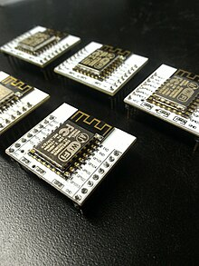
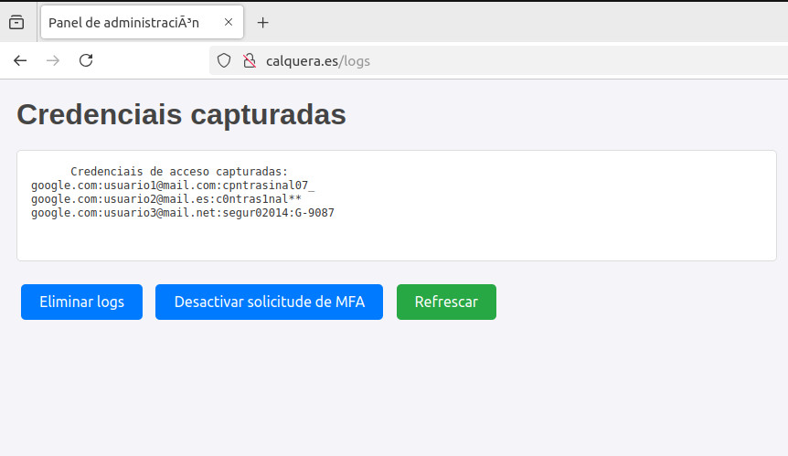
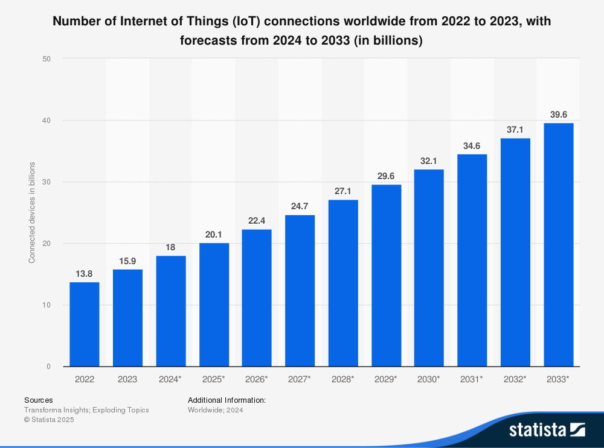
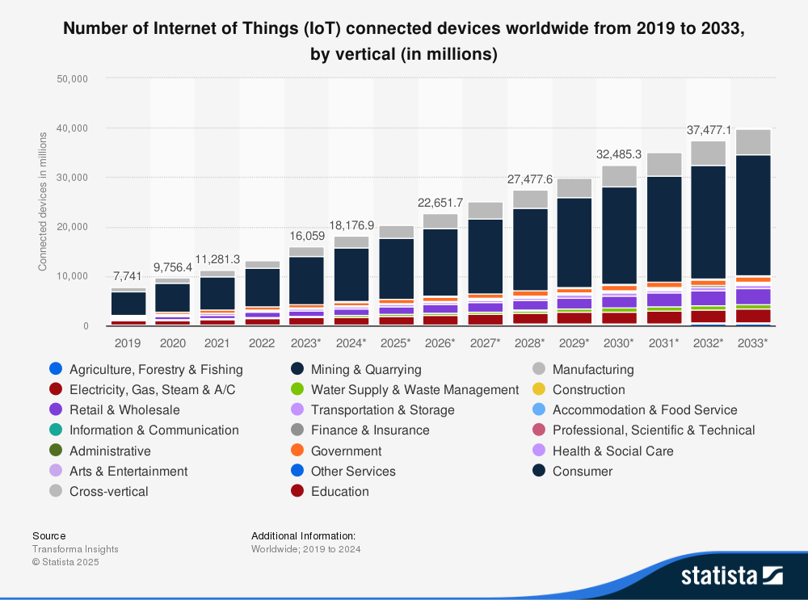

# Repositorio do Traballo de Fin de Grao

_Facultade_ : **Facultade de Informática da Universidade de Coruña.**

_Grao_ : **Enxeñería Informática.**

_Mención_ : **Tecnoloxías da información.**

_Título do traballo_ : **Avaliación de ciberseguridade por medio dun dispositivo IoT de baixo custo.**

_Autor_ : **Iván Romero Zas.**

_Titor_ : **Tiago Manuel Fernández Caramés.**

_Data_ : **Xuño do 2025.**

___________

Este proxecto explora posibles ataques informáticos que poden ser realizados dende un dispositivo IoT baseado no ESP8266, así como as solucións e métodos de defensa para mitigar estes ataques. Tamén se explorarán distintos métodos para proporcionarlles _autonomía enerxética_ aos dispositivos.
 
 

## Ataques Explorados

### __Ataque #1__   :         Denegación de servizo nunha rede WiFi

**Descrición:**  
Enviaranse tramas de [deautenticación](https://mrncciew.com/2014/10/11/802-11-mgmt-deauth-disassociation-frames/) a unha rede WiFi, forzando aos dispositivos conectados a desconectarse sucesivamente. Nas condicións adicadas isto pode interromper completamente o servizo dunha rede WiFi [^1].
 
 
[^1]: O ESP8266 só traballa na banda de frecuencia de 2.4 Ghz, polo tanto só interrumpiría completamente o servizo en WiFis que empreguen exclusivamente esa frecuencia.

 
 
**Solución Proposta:**  
Despregarase un **Sistema de Detección de Intrusos (IDS)** dende un ESP8266 para monitorizar as tramas de deautenticación na rede. Cando se detecten tramas de deauth sospeitosas, o IDS poderá alertar ao administrador da rede ou tomar medidas automáticas para bloquear o ataque. 

> Este ataque emprega de forma íntegra o proxecto [Deauther](https://github.com/SpacehuhnTech/esp8266_deauther), creado por [Spacehuhn](https://spacehuhn.com/). Este proxecto conta cunha licenza de libre distribución e modificación (MIT).
---

### Ataque #2: Roubo de credenciais usando un portal falso

**Descrición:**  
O ESP8266 actúa como un punto de acceso WiFi falso (Evil Twin), imitando unha rede lexítima. Cando os usuarios se conecten a esta rede falsa, as súas credenciais poden ser roubadas mediante un portal de inicio de sesión falso. Ademais, **o atacante pode realizar un ataque Man-in-the-Middle** (MitM) **para facerse incluso con aquelas contas protexidas baixo un factor de dobre autenticación (MFA)**.
 
 

 
 
**Solución Proposta:**  
Estudaranse e comentaranse varias medidas e boas prácticas xerais para previr e mitigar esta clase de situacións.

> Este ataque emprega o proxecto [RogueCaptivePortal](https://github.com/OxMarco/RogueCaptivePortal), creado por [OxMarco](https://github.com/OxMarco) e por [Corey Harding](https://github.com/exploitagency), con varias modificacións substanciais realizadas polo autor do TFG. Este proxecto conta cunha licenza de libre distribución e modificación (MIT).
---

### Ataque #3: DoS lento contra un servidor web

**Descrición:**  
O ataque Slowloris consiste en enviar solicitudes HTTP parciais a un servidor web, mantendo as conexións abertas durante o maior tempo posible. Isto pode esgotar os recursos do servidor e facer que deixe de responder a solicitudes lexítimas. Neste caso, estudarase a eficacia do ESP8266 no roubo de conexións a un servidor estándar Apache2, empurrando o hardware ata o _límite_.

**Solución Proposta:**  
Analizaranse distintas configuracións populares que un administrador dun servidor web pode levar a cabo para evitar caer neste tipo de apretos. Poñeranse aquelas máis eficaces __segundo o criterio do autor do TFG__ en práctica e comprobarase a súa resiliencia fronte ao ESP8266.

> Este ataque empregada código creado dende cero polo autor do TFG.
---
## Conclusión

Este proxecto demostra como o ESP8266, un dispositivo IoT común e extramedamente [barato](https://www.aliexpress.com/w/wholesale-esp8266.html), pode ser utilizado tanto para realizar ataques informáticos como para protexer as redes e sistemas contra eles. A comprensión destes ataques e as súas solucións é fundamental nun contexto onde a relevancia e presenza do Internet das Cousas avanza a grandes zancadas.
 
 

    

 
 

> **NOTA:** As imaxes superiores foron obtidas a través de www.statista.com cunha licenza de estudante.
---

> **ADVERTENZA:** O código deste repositorio está dispoñible como software libre a través dunha licencia GPL v3. Este proxecto conta con software de autores externos, licenciado como open source coa licenza do MIT, que permite o seu uso e modificación dentro deste proxecto. 
> Por Iván Romero Zas